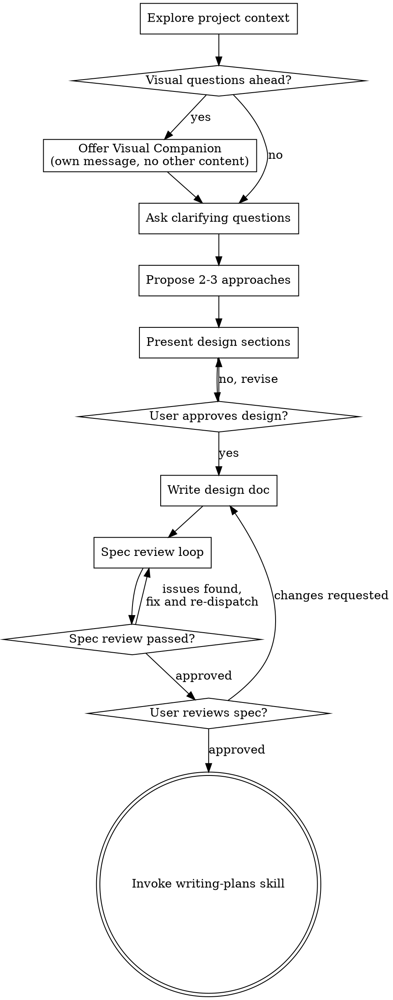

# Brainstorming Ideas Into Designs

Help turn ideas into fully formed designs and specs through natural collaborative dialogue.

Start by understanding the current project context, then ask questions one at a time to refine the idea. Once you understand what you're building, present the design and get user approval.

**No implementation before approval.** Do NOT invoke any implementation skill, write any code, scaffold any project, or take any implementation action until you have presented a design and the user has approved it. This applies to EVERY project regardless of perceived simplicity.

## Step 0: Triage — Lightweight vs Heavyweight

Before diving in, classify the request. This prevents wasting 20 minutes on a full design session for a focused question, or under-thinking a strategic decision.

**Lightweight** — single-domain, one conversation, no cross-cutting impact:
- Focused design question ("how should I structure this component?")
- Single domain (just architecture, or just UX, or just process)
- Answer reachable in one conversation
- No lasting structural consequences

**Heavyweight** — crosses domains, needs research, lasting consequences:
- Strategic question affecting multiple systems ("how should goal tracking work?")
- Crosses architecture + UX + operations
- Needs external research (how do others solve this?)
- Decision shapes data models, project structure, or user flows

State the classification before proceeding:
```
Classification: {lightweight | heavyweight}
Reasoning: {one sentence why}
```

### Lightweight Path: Socratic Refinement

For focused questions. Think 5-minute whiteboard chat, not a design committee.

1. **Pick the right lens** — architecture? product? process? Match to the question domain.
2. **Clarify** — ask 2-3 sharpening questions. What are the constraints? What matters most? What's already been considered?
3. **Explore** — propose 2 options with clear trade-offs. Be opinionated: "I'd go with A because..." not "both have merit."
4. **Detail** — after the user picks a direction, flesh it out: what changes, what the structure looks like, what to watch out for.
5. **Capture Decision** — write a brief design note to `docs/specs/YYYY-MM-DD-<topic>-brainstorm.md`. Even lightweight decisions deserve a paper trail — reasoning dies in context windows.

**Upgrade trigger:** If clarifying questions reveal cross-cutting complexity, upgrade to heavyweight. Tell the user: "This is bigger than it looked — upgrading to full brainstorm."

### Heavyweight Path

**Frame-Diverge-Converge-Output workflow:** (1) Frame the problem with 5 Whys and "How Might We" questions, (2) Diverge with uncritical idea generation (quantity over quality), (3) Converge by evaluating against constraints and selecting top candidates, (4) Output the selected approach as a structured spec. This prevents premature convergence on the first decent idea.

For strategic questions, follow the full checklist below (Explore → Questions → Approaches → Design → Spec → Review → Plan).

Multi-role parallel analysis: spawn specialized agent perspectives (system-architect, product-owner, security-reviewer, devil's-advocate) to analyze the same design from different angles simultaneously. Synthesize insights across roles. Produces: Data Model, State Machine, Error Handling, Observability, Configuration Model, Boundary Scenarios.

## Anti-Pattern: "This Is Too Simple To Need A Design"

Every project goes through this process. A todo list, a single-function utility, a config change — all of them. "Simple" projects are where unexamined assumptions cause the most wasted work. The design can be short (a few sentences for truly simple projects), but you MUST present it and get approval.

## Ideation Toolkit

These frameworks are **tools you can deploy**, not mandatory steps. Pick the lens that fits the idea. Don't run every framework mechanically.

### 7 Lenses of Variation

When generating idea variations in the Diverge phase, apply these lenses to push beyond the obvious:

- **Inversion:** "What if we did the opposite?"
- **Constraint removal:** "What if budget/time/tech weren't factors?"
- **Audience shift:** "What if this were for [different user]?"
- **Combination:** "What if we merged this with [adjacent idea]?"
- **Simplification:** "What's the version that's 10x simpler?"
- **10x version:** "What would this look like at massive scale?"
- **Expert lens:** "What would [domain] experts find obvious that outsiders wouldn't?"

Generate 5-8 variations, not 20. Each variation must explain *why* it exists (which lens generated it), not just *what* it is.

### SCAMPER

For transforming an existing idea through seven operations — Substitute, Combine, Adapt, Modify, Put to other uses, Eliminate, Reverse. Best for improving or reimagining existing products/features.

### How Might We (HMW)

Reframe problems as opportunities: "How might we [desired outcome] for [specific user] without [key constraint]?" Generate multiple HMW framings of the same problem — different framings unlock different solutions. Good HMWs are narrow enough to be actionable but broad enough to allow creative solutions.

**Best for:** Reframing stuck thinking. When someone is anchored on a solution, pull them back to the problem.

### First Principles Thinking

Break down to fundamental truths, then rebuild: (1) What do we *know* is true? (2) What are we *assuming*? (3) Which assumptions can we challenge? (4) Rebuild from the truths alone.

**Best for:** Breaking out of incremental thinking. When every idea feels like a small improvement on the status quo.

### Jobs to Be Done (JTBD)

Focus on the user's actual goal — functional job (task), emotional job (feeling), social job (perception). Format: "When I [situation], I want to [motivation], so I can [expected outcome]." Key insight: the competing product is not always in the same category.

**Best for:** Understanding the real problem. When you're not sure if you're solving the right thing.

### Constraint-Based Ideation

Deliberately impose constraints to force creative solutions: "What if you only had 1 day?", "What if it could only have one feature?", "What if the user had never used a computer?"

**Best for:** Cutting through complexity. When the idea is growing too large or too vague.

### Pre-mortem

Imagine the idea has already failed. Work backwards: What went wrong? List every plausible failure mode. Which are preventable? Which would kill the project?

**Best for:** Stress-testing ideas in Phase 2 that feel good but haven't been pressure-tested.

## Refinement Criteria Rubric

Use during the Converge phase to evaluate candidate directions.

### User Value — Painkiller vs Vitamin

- **Painkiller:** Acute, frequent problem. Users actively seek this out, will switch from current solution. Signs: emotional descriptions, existing workarounds, willingness to pay.
- **Vitamin:** Nice to have. Users won't go out of their way. Signs: polite nods, "that's cool," no behavior change.

Key questions: Can you name 3 specific people with this problem right now? What are they doing today instead? Would they switch? How often do they hit this problem?

### Feasibility

Technical: Does the core technology exist? What's the hardest problem? Dependencies on third parties?
Resource: Minimum team/effort for MVP? Specialized expertise needed? Regulatory requirements?
Time-to-value: How quickly can you get something in front of users?

### Differentiation

What makes this genuinely *different*, not just better? Types (strongest to weakest): new capability > 10x improvement > new audience > new context > better UX > cheaper.

### Decision Matrix

|                    | High Feasibility | Low Feasibility |
|--------------------|-------------------|-----------------|
| **High Value**     | Do this first     | Worth the risk   |
| **Low Value**      | Only if trivial   | Don't do this    |

Use differentiation as the tiebreaker between options in the same quadrant.

## The "Not Doing" List

**Every brainstorming output MUST include a "Not Doing" list.** This is arguably the most valuable artifact. Focus is about saying no to good ideas. Make the trade-offs explicit.

Format:
```markdown
## Not Doing (and Why)
- [Thing 1] — [reason it's tempting but wrong for now]
- [Thing 2] — [reason]
- [Thing 3] — [reason]
```

The "Not Doing" list prevents scope creep, forces honest prioritization, and gives future-you a record of what was deliberately excluded (and why).

## Red Flags Checklist

Watch for these anti-patterns during ideation. If you spot them, call them out:

- **Generating 20+ shallow variations** instead of 5-8 considered ones
- **Skipping "who is this for"** — every good idea starts with a person and their problem
- **No assumptions surfaced** before committing to a direction
- **Yes-machining weak ideas** — push back with specificity and kindness
- **No "Not Doing" list** — a plan without explicit exclusions is incomplete
- **Ignoring the codebase** — if you're in a project, existing architecture is a constraint and an opportunity
- **Jumping to output** without running diverge and converge phases
- **"Everyone could use this"** — if you can't name a specific user, the value isn't clear
- **"It's like X but better"** — marginal improvements rarely drive adoption
- **Solution-embedded problem statements** — "How might we build a chatbot?" is a solution, not a problem

## Checklist

You MUST create a task for each of these items and complete them in order:

1. **Explore project context** — check files, docs, recent commits
2. **Offer visual companion** (if topic will involve visual questions) — this is its own message, not combined with a clarifying question. See the Visual Companion section below.
3. **Ask clarifying questions** — one at a time, understand purpose/constraints/success criteria
4. **Propose 2-3 approaches** — with trade-offs and your recommendation
5. **Present design** — in sections scaled to their complexity, get user approval after each section
6. **Write design doc** — save to `docs/specs/YYYY-MM-DD-<topic>-design.md` and commit
7. **Capture Decision** — record the decision explicitly: what was chosen, what was rejected, and why. Reasoning evaporates from context windows — if it's not written down, it didn't happen.
8. **Spec review loop** — dispatch spec-document-reviewer subagent with precisely crafted review context (never your session history); fix issues and re-dispatch until approved (max 3 iterations, then surface to human)
9. **User reviews written spec** — ask user to review the spec file before proceeding
10. **Transition to implementation** — invoke writing-plans skill to create implementation plan

## Process Flow



**The terminal state is invoking writing-plans.** Do NOT invoke frontend-design, mcp-builder, or any other implementation skill. The ONLY skill you invoke after brainstorming is writing-plans.

## The Process

**Understanding the idea:**

- Check out the current project state first (files, docs, recent commits)
- Before asking detailed questions, assess scope: if the request describes multiple independent subsystems (e.g., "build a platform with chat, file storage, billing, and analytics"), flag this immediately. Don't spend questions refining details of a project that needs to be decomposed first.
- If the project is too large for a single spec, help the user decompose into sub-projects: what are the independent pieces, how do they relate, what order should they be built? Then brainstorm the first sub-project through the normal design flow. Each sub-project gets its own spec → plan → implementation cycle.
- For appropriately-scoped projects, conduct a structured interview across dimensions: Technical Implementation (architecture tradeoffs, edge cases, failure modes), User Experience (workflows, error states, progressive disclosure), Operational (deployment, monitoring, rollback), and Scope (what's explicitly out of scope)
- Restate the idea as a crisp "How Might We" problem statement — this forces clarity on what's actually being solved
- Ask questions one at a time to refine the idea
- Prefer multiple choice questions when possible, but open-ended is fine too
- Only one question per message - if a topic needs more exploration, break it into multiple questions
- Focus on understanding: purpose, constraints, success criteria

**Multi-perspective analysis:** For complex designs, mentally adopt specialized perspectives (system-architect, product-owner, security-reviewer, devil's-advocate) to analyze the same design from different angles. Surface conflicts early rather than discovering them during implementation.

**Exploring approaches:**

- Propose 2-3 different approaches with trade-offs
- Present options conversationally with your recommendation and reasoning
- Lead with your recommended option and explain why
- Deploy ideation frameworks from the Toolkit section when they fit — use the 7 Lenses to generate variations, SCAMPER to transform existing ideas, JTBD to reframe the problem

**Presenting the design:**

- Once you believe you understand what you're building, present the design
- Scale each section to its complexity: a few sentences if straightforward, up to 200-300 words if nuanced
- Ask after each section whether it looks right so far
- Cover: architecture, components, data flow, error handling, testing
- Be ready to go back and clarify if something doesn't make sense

**Assumption Audit:** For every direction under consideration, explicitly surface:
- **Must Be True** — dealbreaker assumptions that kill the idea if wrong. Validate before building.
- **Should Be True** — important but adjustable. You can pivot if these are wrong.
- **Might Be True** — nice-to-have assumptions. Don't validate until core is proven.

**Design for isolation and clarity:**

- Break the system into smaller units that each have one clear purpose, communicate through well-defined interfaces, and can be understood and tested independently
- For each unit, you should be able to answer: what does it do, how do you use it, and what does it depend on?
- Can someone understand what a unit does without reading its internals? Can you change the internals without breaking consumers? If not, the boundaries need work.
- Smaller, well-bounded units are also easier for you to work with - you reason better about code you can hold in context at once, and your edits are more reliable when files are focused. When a file grows large, that's often a signal that it's doing too much.

**Working in existing codebases:**

- Explore the current structure before proposing changes. Follow existing patterns.
- Where existing code has problems that affect the work (e.g., a file that's grown too large, unclear boundaries, tangled responsibilities), include targeted improvements as part of the design - the way a good developer improves code they're working in.
- Don't propose unrelated refactoring. Stay focused on what serves the current goal.

## After the Design

**Documentation:**

- Write the validated design (spec) to `docs/specs/YYYY-MM-DD-<topic>-design.md`
  - (User preferences for spec location override this default)
- Use elements-of-style:writing-clearly-and-concisely skill if available
- Commit the design document to git

**Spec Review Loop:**
After writing the spec document:

1. Dispatch spec-document-reviewer subagent (see spec-document-reviewer-prompt.md)
2. If Issues Found: fix, re-dispatch, repeat until Approved
3. If loop exceeds 3 iterations, surface to human for guidance

**User Review Gate:**
After the spec review loop passes, ask the user to review the written spec before proceeding:

> "Spec written and committed to `<path>`. Please review it and let me know if you want to make any changes before we start writing out the implementation plan."

Wait for the user's response. If they request changes, make them and re-run the spec review loop. Only proceed once the user approves.

**PRD as design output:** For product features, generate a structured Product Requirements Document with user stories, acceptance criteria, non-functional requirements, and priority tiers (P0/P1/P2). The PRD becomes the single source of truth the implementation plan references.

**Implementation:**

- Invoke the writing-plans skill to create a detailed implementation plan
- Do NOT invoke any other skill. writing-plans is the next step.

## Key Principles

- **Creativity Faucet** -- accept that early ideas are low-quality. The bad ideas must flow first to clear the pipe. Don't self-censor during divergent thinking; filter during convergence
- **One question at a time** - Don't overwhelm with multiple questions
- **Multiple choice preferred** - Easier to answer than open-ended when possible
- **YAGNI ruthlessly** - Remove unnecessary features from all designs
- **Explore alternatives** - Always propose 2-3 approaches before settling
- **Incremental validation** - Present design, get approval before moving on
- **Be flexible** - Go back and clarify when something doesn't make sense
- **Be honest, not supportive** - If an idea is weak, say so with kindness. A good ideation partner is not a yes-machine. Push back on complexity, question real value, point out when the emperor has no clothes.
- **The restatement changes the frame** - "Help restaurants compete" becomes "retain existing customers." Reframing is where the real insight lives.

## Visual Companion

A browser-based companion for showing mockups, diagrams, and visual options during brainstorming. Available as a tool — not a mode. Accepting the companion means it's available for questions that benefit from visual treatment; it does NOT mean every question goes through the browser.

**Offering the companion:** When you anticipate that upcoming questions will involve visual content (mockups, layouts, diagrams), offer it once for consent:
> "Some of what we're working on might be easier to explain if I can show it to you in a web browser. I can put together mockups, diagrams, comparisons, and other visuals as we go. This feature is still new and can be token-intensive. Want to try it? (Requires opening a local URL)"

**This offer MUST be its own message.** Do not combine it with clarifying questions, context summaries, or any other content. The message should contain ONLY the offer above and nothing else. Wait for the user's response before continuing. If they decline, proceed with text-only brainstorming.

**Per-question decision:** Even after the user accepts, decide FOR EACH QUESTION whether to use the browser or the terminal. The test: **would the user understand this better by seeing it than reading it?**

- **Use the browser** for content that IS visual — mockups, wireframes, layout comparisons, architecture diagrams, side-by-side visual designs
- **Use the terminal** for content that is text — requirements questions, conceptual choices, tradeoff lists, A/B/C/D text options, scope decisions

A question about a UI topic is not automatically a visual question. "What does personality mean in this context?" is a conceptual question — use the terminal. "Which wizard layout works better?" is a visual question — use the browser.

If they agree to the companion, read the detailed guide before proceeding:
`skills/brainstorming/visual-companion.md`
