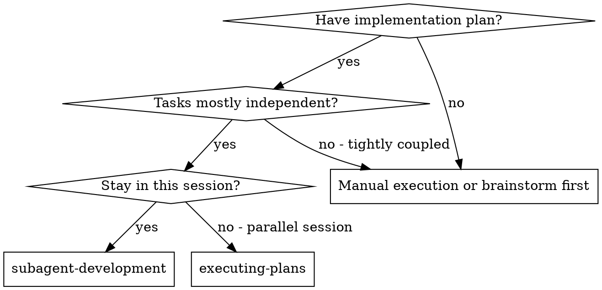
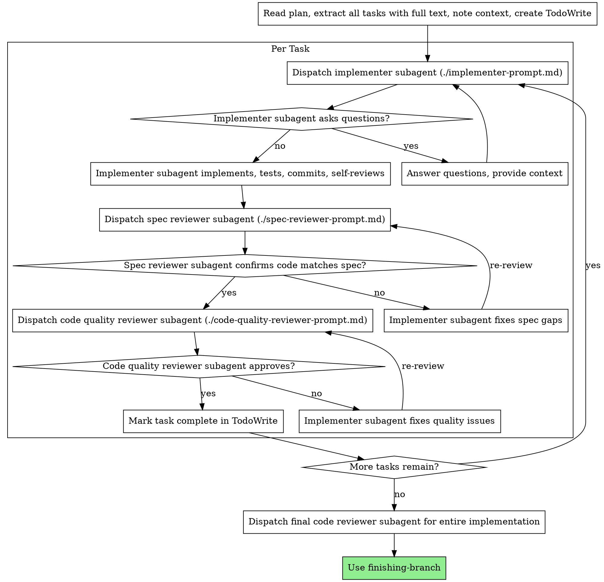

# Subagent-Driven Development

Execute plan by dispatching fresh subagent per task, with two-stage review after each: spec compliance review first, then code quality review.

**Why subagents:** You delegate tasks to specialized agents with isolated context. By precisely crafting their instructions and context, you ensure they stay focused and succeed at their task. They should never inherit your session's context or history — you construct exactly what they need. This also preserves your own context for coordination work.

**Core principle:** Fresh subagent per task + two-stage review (spec then quality) = high quality, fast iteration

## Step 0-PRE: Plan Validation Gate

Before parsing tasks, validate the plan is actually dispatchable. This runs ONCE before any agent is spawned. A bad plan wastes every agent downstream.

**PR-Sizing Check** — every task must be bounded to ~1 PR. Flag any task that:
- Touches more than **3 services** simultaneously (e.g., NestJS + Flutter + Spring Boot in one task)
- Modifies more than **15 files**
- Spans more than one tech-stack layer without a clear seam (split at the layer boundary)

These are "too big for one agent" signals. If an agent can't hold the full change in context, it will produce partial or broken work.

**If any task fails the sizing check:**
```
PLAN VALIDATION FAILED:
Task N: "[task title]" is too large for a single PR.
Touches: [list services/files]
Required split: [suggested sub-tasks A, B]
--> Update the plan file before continuing.
```

Do NOT proceed with dispatch. Fix the plan first.

**Task Dependency Ordering:** when tasks have soft dependencies (Task 3 uses types defined in Task 1), execute in dependency order even though they could technically run independently. Mark dependencies explicitly: `depends_on: [task-1]`. Running dependent tasks in parallel causes merge conflicts and type errors.

### Step -1: Research Phase (optional)

Use when the feature touches an **unfamiliar external API**, a new compliance domain, or a third-party service the team hasn't integrated before.

Dispatch a `general-purpose` agent with:
- The feature name and the specific unknown (e.g., "Stripe Connect payouts API — we haven't used this before")
- Output target: `docs/research/<feature>.md`
- **Mandatory constraint in prompt:** "Your role is RESEARCH ONLY. Describe what exists — APIs, constraints, auth model, rate limits, SDK options, gotchas. Do NOT propose improvements, suggest refactors, or recommend implementation approaches."

The research doc is passed as a file path to the implementer and spec reviewer — they verify API usage against it.

**Skip when:** the tech stack is familiar, no external unknowns, or the plan was produced from a previous research session.

**Context isolation:** After research completes and `docs/research/<feature>.md` is committed, issue `/clear` before dispatching any implementer. Pass only the research doc path — do NOT carry the research agent's conversation forward.

## When to Use



**vs. Executing Plans (parallel session):**
- Same session (no context switch)
- Fresh subagent per task (no context pollution)
- Two-stage review after each task: spec compliance first, then code quality
- Faster iteration (no human-in-loop between tasks)

## The Process



**Incremental test suite validation:** after each task completes and passes its own tests, run the FULL test suite (not just the task's tests) before moving to the next task. If a previously-passing test breaks, fix it before proceeding. This catches integration issues early rather than discovering them in the final review.

## Model Selection

Use the least powerful model that can handle each role to conserve cost and increase speed.

**Mechanical implementation tasks** (isolated functions, clear specs, 1-2 files): use a fast, cheap model. Most implementation tasks are mechanical when the plan is well-specified.

**Integration and judgment tasks** (multi-file coordination, pattern matching, debugging): use a standard model.

**Architecture, design, and review tasks**: use the most capable available model.

**Context budget check:** before dispatching, estimate context needed (task text + referenced files + test files). If estimated context > 60% of model window, split the task or provide only essential files. Overloaded context = degraded output.

**Task complexity signals:**
- Touches 1-2 files with a complete spec → cheap model
- Touches multiple files with integration concerns → standard model
- Requires design judgment or broad codebase understanding → most capable model

### Context Budget

Before dispatching an implementer, estimate the context needed (task text + referenced files + test files + framework docs). If estimated context > 60% of model window, either split the task or use a more capable model with a larger window. Formula: `context_estimate = task_text + sum(referenced_file_sizes) + test_boilerplate`.

## Handling Implementer Status

Implementer subagents report one of four statuses. Handle each appropriately:

**DONE:** Proceed to spec compliance review.

**DONE_WITH_CONCERNS:** The implementer completed the work but flagged doubts. Read the concerns before proceeding. If the concerns are about correctness or scope, address them before review. If they're observations (e.g., "this file is getting large"), note them and proceed to review.

**NEEDS_CONTEXT:** The implementer needs information that wasn't provided. Provide the missing context and re-dispatch.

**BLOCKED:** The implementer cannot complete the task. Assess the blocker:
1. If it's a context problem, provide more context and re-dispatch with the same model
2. If the task requires more reasoning, re-dispatch with a more capable model
3. If the task is too large, break it into smaller pieces
4. If the plan itself is wrong, escalate to the human

**TIMEOUT:** If an implementer has been running >15 minutes without completing, check progress. If stuck in a loop (repeated test failures, circular debugging): (1) kill the agent, (2) extract what it learned, (3) re-dispatch with a narrower scope or more context. Stuck agents waste tokens without progress.

**Never** ignore an escalation or force the same model to retry without changes. If the implementer said it's stuck, something needs to change.

## Prompt Templates

- `./implementer-prompt.md` - Dispatch implementer subagent
- `./spec-reviewer-prompt.md` - Dispatch spec compliance reviewer subagent
- `./code-quality-reviewer-prompt.md` - Dispatch code quality reviewer subagent

## Full Suite Validation

After each task completes and passes its own tests, run the FULL test suite before moving to the next task. If a previously-passing test breaks, the current task caused a regression -- fix it before proceeding. Cost of catching regression here: minutes. Cost of catching it after 3 more tasks: hours of untangling.

## Example Workflow

```
You: I'm using Subagent-Driven Development to execute this plan.

[Read plan file once: docs/plans/feature-plan.md]
[Extract all 5 tasks with full text and context]
[Create TodoWrite with all tasks]

Task 1: Hook installation script

[Get Task 1 text and context (already extracted)]
[Dispatch implementation subagent with full task text + context]

Implementer: "Before I begin - should the hook be installed at user or system level?"

You: "User level (~/.config/claude/hooks/)"

Implementer: "Got it. Implementing now..."
[Later] Implementer:
  - Implemented install-hook command
  - Added tests, 5/5 passing
  - Self-review: Found I missed --force flag, added it
  - Committed

[Dispatch spec compliance reviewer]
Spec reviewer: ✅ Spec compliant - all requirements met, nothing extra

[Get git SHAs, dispatch code quality reviewer]
Code reviewer: Strengths: Good test coverage, clean. Issues: None. Approved.

[Mark Task 1 complete]

Task 2: Recovery modes

[Get Task 2 text and context (already extracted)]
[Dispatch implementation subagent with full task text + context]

Implementer: [No questions, proceeds]
Implementer:
  - Added verify/repair modes
  - 8/8 tests passing
  - Self-review: All good
  - Committed

[Dispatch spec compliance reviewer]
Spec reviewer: ❌ Issues:
  - Missing: Progress reporting (spec says "report every 100 items")
  - Extra: Added --json flag (not requested)

[Implementer fixes issues]
Implementer: Removed --json flag, added progress reporting

[Spec reviewer reviews again]
Spec reviewer: ✅ Spec compliant now

[Dispatch code quality reviewer]
Code reviewer: Strengths: Solid. Issues (Important): Magic number (100)

[Implementer fixes]
Implementer: Extracted PROGRESS_INTERVAL constant

[Code reviewer reviews again]
Code reviewer: ✅ Approved

[Mark Task 2 complete]

...

[After all tasks]
[Dispatch final code-reviewer]
Final reviewer: All requirements met, ready to merge

Done!
```

## Advantages

**vs. Manual execution:**
- Subagents follow TDD naturally
- Fresh context per task (no confusion)
- Parallel-safe (subagents don't interfere)
- Subagent can ask questions (before AND during work)

**vs. Executing Plans:**
- Same session (no handoff)
- Continuous progress (no waiting)
- Review checkpoints automatic

**Efficiency gains:**
- No file reading overhead (controller provides full text)
- Controller curates exactly what context is needed
- Subagent gets complete information upfront
- Questions surfaced before work begins (not after)

**Quality gates:**
- Self-review catches issues before handoff
- Two-stage review: spec compliance, then code quality
- Review loops ensure fixes actually work
- Spec compliance prevents over/under-building
- Code quality ensures implementation is well-built

**Cost:**
- More subagent invocations (implementer + 2 reviewers per task)
- Controller does more prep work (extracting all tasks upfront)
- Review loops add iterations
- But catches issues early (cheaper than debugging later)

## Red Flags

**Never:**
- Skip plan validation (Step 0-PRE) — agents without a validated plan produce unreviewed, unverifiable output
- Dispatch a task that touches >3 services or >15 files — it's too big for one agent, split it
- Start implementation on main/master branch without explicit user consent
- Skip reviews (spec compliance OR code quality)
- Proceed with unfixed issues
- Dispatch multiple implementation subagents in parallel (conflicts)
- Make subagent read plan file (provide full text instead)
- Skip scene-setting context (subagent needs to understand where task fits)
- Ignore subagent questions (answer before letting them proceed)
- Accept "close enough" on spec compliance (spec reviewer found issues = not done)
- Skip review loops (reviewer found issues = implementer fixes = review again)
- Let implementer self-review replace actual review (both are needed)
- **Start code quality review before spec compliance is ✅** (wrong order)
- Move to next task while either review has open issues

**If subagent asks questions:**
- Answer clearly and completely
- Provide additional context if needed
- Don't rush them into implementation

**If reviewer finds issues:**
- Implementer (same subagent) fixes them
- Reviewer reviews again
- Repeat until approved
- Don't skip the re-review

**If subagent fails task:**
- Dispatch fix subagent with specific instructions
- Don't try to fix manually (context pollution)

## Integration

**Required workflow skills:**
- **git-worktrees** - REQUIRED: Set up isolated workspace before starting
- **plans** - Creates the plan this skill executes
- **code-review** - Code review template for reviewer subagents
- **finishing-branch** - Complete development after all tasks

**Subagents should use:**
- **tdd** - Subagents follow TDD for each task

**Alternative workflow:**
- **plans** - Use for parallel session instead of same-session execution
